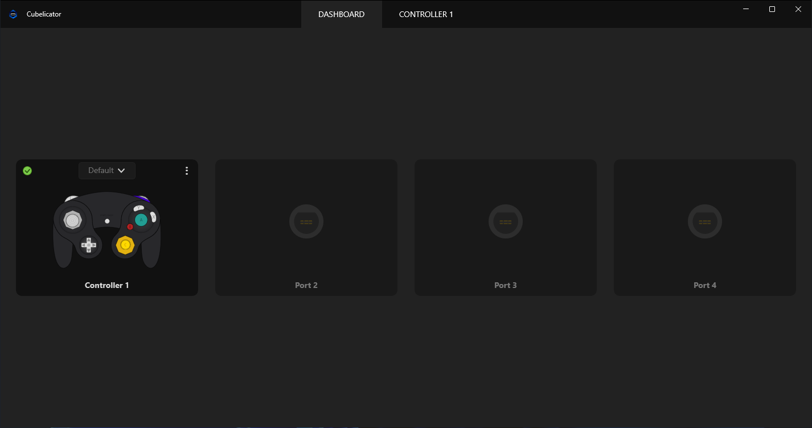
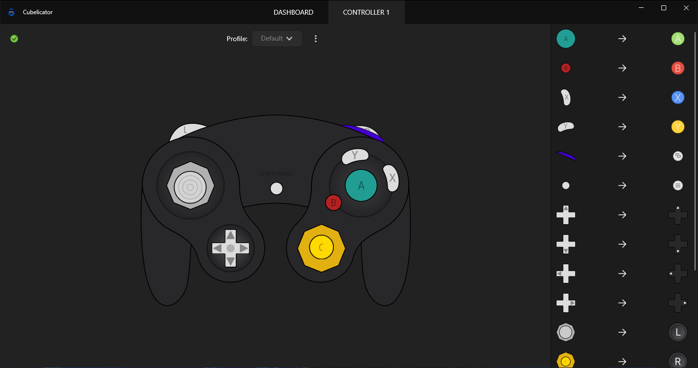
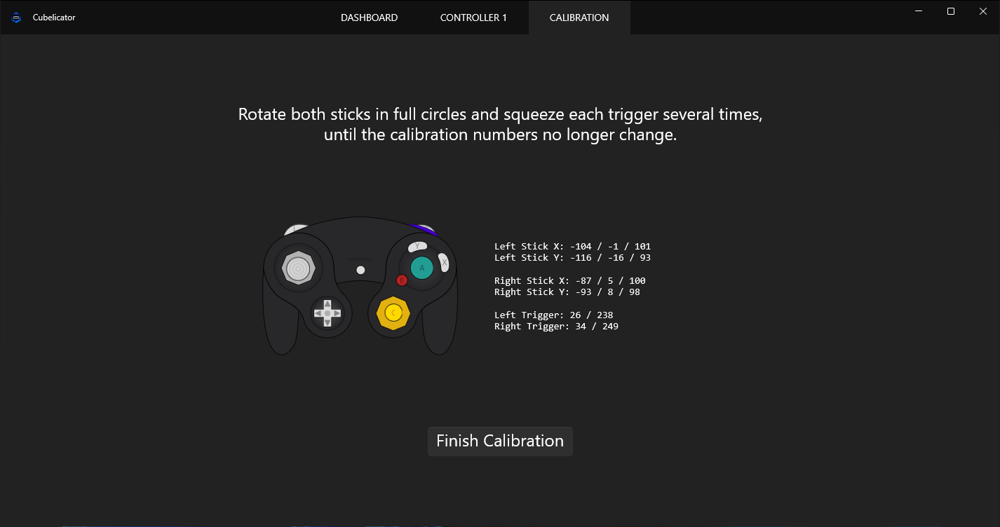

# Cubelicator

Cubelicator is a desktop application for configuring, calibrating, and managing GameCube controller inputs. It provides a clean UI for adjusting controller mappings, sensitivity, and calibration profiles in real time.

---

## ✨ Features

- Dashboard overview for quick controller statuses and quick profiles switching
- Input editor for mapping buttons, sticks, triggers and sensitivity and deadzone configurations
- Calibration tool for precise analog tuning
- System tray support for background operation
- Fast, lightweight Windows desktop experience

---

## 🖥️ Screenshots

### Dashboard

The dashboard provides a quick overview of connected controllers and their current state.

---

### Controller Editor

The editor allows you to remap buttons, adjust stick behavior, and configure profiles.

---

### Calibration Tool

The calibration screen helps fine-tune analog sticks and triggers for accurate input detection.

---

## ⚠️ Prerequisites

Before using Cubelicator, you must install the required virtual controller driver:

### ViGEmBus Driver

Cubelicator uses the ViGEm (Virtual Gamepad Emulation Framework) to emulate Xbox controllers.

- Install ViGEmBus driver:  
  https://github.com/nefarius/ViGEmBus/releases/download/v1.18.367.0/ViGEmBus_1.18.367_x64_x86.exe

---

### GameCube Adapter Driver (Zadig)

Cubelicator requires the GameCube controller adapter USB driver to be replaced in order to function.

- Download Zadig: https://zadig.akeo.ie/

Steps:

1. Open Zadig
2. Go to **Options → List All Devices**
3. Select **WUP-028** (USB ID: `0573 0337`)
4. If it does not appear, select the adapter with the same USB ID
5. Choose **WinUSB**
6. Click **Replace Driver**
7. Wait for installation to complete

---

### .NET 8 Desktop Runtime

Cubelicator requires the .NET 8 Desktop Runtime to run.

- Download: https://dotnet.microsoft.com/download/dotnet/8.0
- Install **.NET Desktop Runtime (x64)**

---
